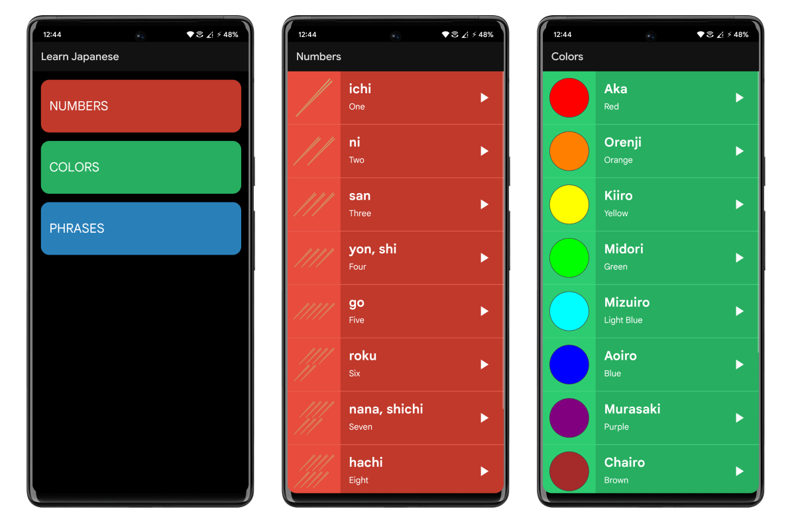

## Learn Japanese
### An Android Application which provides Japanese translations and pronounciations of Numbers, Colors and Phrases. Users can use this application to read and listen to Japanese translations of Numbers, Colors and some common Phrases which are used in conversations.

